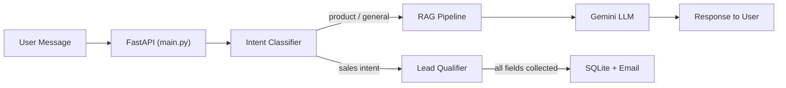

# Healthcare Lead Conversational Agent — Module-wise Viva Explanation

## 🎯 Project in One Line
> A smart AI chatbot for a medical products company (PolyMedicure) that answers product queries using RAG and automatically captures sales leads via a state-machine conversation flow.

---

## Technology Stack

| Layer | Technology |
|---|---|
| AI / LLM | Google Gemini API (`gemini-2.0-flash`, `gemini-embedding-001`) |
| Backend | FastAPI (Python) |
| Frontend | Static HTML / CSS / JavaScript |
| Vector DB | ChromaDB |
| Relational DB | SQLite |
| Scraping | BeautifulSoup + Requests |
| Containerization | Docker + Docker Compose |

---

## High-Level Data Flow



**Three main phases:**
1. **Bootstrap** — Scraper crawls PolyMedicure website → ETL chunks + embeds text → stores in ChromaDB.
2. **Conversation** — User asks a question → intent classified → answered via RAG or lead flow.
3. **Lead Capture** — Collects details via state machine → saves to DB → emails sales team.

---

## Module-by-Module Breakdown

### 1. [run.py](file:///home/hariharan-v-s/AI_PROJECT/run.py) — Application Entry Point
- Starts the **Uvicorn** ASGI server.
- Loads environment variables and launches `backend.main` as the FastAPI app.

> **Viva Q:** *Why Uvicorn?*
> Because FastAPI is an ASGI framework and Uvicorn is a high-performance ASGI server built on `uvloop`.

---

### 2. [backend/main.py](file:///home/hariharan-v-s/AI_PROJECT/backend/main.py) — FastAPI App Initialization
- Creates the FastAPI application instance.
- **Lifecycle hooks**: On startup, it initializes SQLite ([database.py](file:///home/hariharan-v-s/AI_PROJECT/backend/database.py)) and checks if ChromaDB is empty — if so, triggers background web scraping.
- **Mounts API routers**: `/api/chat` and `/api/admin`.
- **Serves the frontend**: Mounts the `frontend/` directory as static files so the HTML/CSS/JS UI is served directly by FastAPI.

> **Viva Q:** *Why serve the frontend from FastAPI instead of a separate server?*
> It keeps deployment simple — one Docker container serves both backend and frontend.

---

### 3. [backend/config.py](file:///home/hariharan-v-s/AI_PROJECT/backend/config.py) — Configuration Management
- Uses **Pydantic `BaseSettings`** to load all config from the [.env](file:///home/hariharan-v-s/AI_PROJECT/.env) file.
- Key variables: `GEMINI_API_KEY`, `CHROMADB_PATH`, `SQLITE_DB_PATH`, `SCRAPER_BASE_URL`, `RAG_SIMILARITY_THRESHOLD`, `SMTP` credentials.

> **Viva Q:** *Why Pydantic for config?*
> It provides automatic type validation and environment variable parsing — if a required key is missing, the app crashes early with a clear error.

---

### 4. [backend/database.py](file:///home/hariharan-v-s/AI_PROJECT/backend/database.py) — SQLite Operations
- Creates the `leads` table if it doesn't exist.
- Provides `save_lead()` and `get_all_leads()` functions.
- Stores: first name, last name, email, phone, company, address, and timestamp.

> **Viva Q:** *Why SQLite over PostgreSQL?*
> SQLite is serverless and file-based — perfect for a lightweight project without heavy concurrent writes.

---

### 5. [backend/models/schemas.py](file:///home/hariharan-v-s/AI_PROJECT/backend/models/schemas.py) — Pydantic Data Schemas
- Defines request/response models (e.g., `ChatRequest`, `ChatResponse`).
- FastAPI uses these for **automatic request validation** and **Swagger documentation**.

> **Viva Q:** *What happens if a user sends invalid data?*
> FastAPI automatically returns a `422 Unprocessable Entity` error with a description of which field failed validation.

---

### 6. [backend/api/chat.py](file:///home/hariharan-v-s/AI_PROJECT/backend/api/chat.py) — Chat Endpoint (Orchestrator)
This is the **brain** of the chatbot. When a user sends a message:
1. Retrieves (or creates) the user's **session** via `session_manager`.
2. Calls `intent.py` to **classify the intent**.
3. **Decision logic:**
   - If the session is already in lead-qualification mode → routes to `lead_qualifier.py`.
   - If intent is `sales_intent` or `distributor_query` → starts lead qualification.
   - Otherwise → routes to `rag.py` for a knowledge-based answer.
4. Updates conversation history and returns the response.

> **Viva Q:** *How does it know when to start collecting lead details?*
> If the intent classifier detects `sales_intent` or `distributor_query`, the chat endpoint triggers the lead-qualifier state machine.

---

### 7. [backend/api/admin.py](file:///home/hariharan-v-s/AI_PROJECT/backend/api/admin.py) — Admin Endpoints
- `GET /api/admin/leads` — Returns all captured leads (for the sales team).
- `POST /api/admin/scrape` — Manually triggers a re-scrape of the website.

---

### 8. [backend/core/intent.py](file:///home/hariharan-v-s/AI_PROJECT/backend/core/intent.py) — Intent Classification
- Uses **few-shot prompting** with Gemini to classify messages.
- Seven predefined intents:

| Intent | Example |
|---|---|
| `product_query` | "Tell me about IV cannulas" |
| `distributor_query` | "I want to become a distributor" |
| `territory_query` | "Do you operate in Africa?" |
| `pricing_query` | "What's the price of sutures?" |
| `sales_intent` | "I'd like to place an order" |
| `general_enquiry` | "Hello" / "What does your company do?" |
| `out_of_scope` | "What's the weather today?" |

- The prompt includes example inputs and expected outputs so Gemini learns the pattern (**few-shot learning**).
- Falls back to `general_enquiry` if Gemini's response doesn't match any known intent.

> **Viva Q:** *Why few-shot prompting instead of fine-tuning?*
> Few-shot prompting doesn't require a custom training dataset or retraining — it's faster to develop, cheaper, and easy to update by simply editing the prompt.

---

### 9. [backend/core/lead_qualifier.py](file:///home/hariharan-v-s/AI_PROJECT/backend/core/lead_qualifier.py) — Lead Qualification State Machine
A **finite state machine** that walks the user through data collection:

```
NOT_STARTED → CONSENT_PENDING → COLLECTING → CONFIRMING → COMPLETED
```

- **CONSENT_PENDING**: Asks *"Would you like to share your details?"*
- **COLLECTING**: Iterates through fields — First Name, Last Name, Email (regex validation), Phone (validation), Company (optional), Address.
- **CONFIRMING**: Displays a summary and asks for confirmation.
- **COMPLETED**: Saves to SQLite + sends email notification.

> **Viva Q:** *Why a state machine?*
> It prevents the conversation from skipping steps or losing context. Each state knows exactly what input to expect and what to do next.

---

### 10. [backend/core/rag.py](file:///home/hariharan-v-s/AI_PROJECT/backend/core/rag.py) — RAG Pipeline
The core AI answering mechanism — **Retrieval-Augmented Generation**:

| Step | What Happens |
|---|---|
| 1. **Embed** | User query → converted to a vector via `gemini-embedding-001` |
| 2. **Retrieve** | Top-5 closest chunks fetched from ChromaDB |
| 3. **Filter** | Chunks below `RAG_SIMILARITY_THRESHOLD` are discarded |
| 4. **Format** | Remaining chunks formatted into a context block with source URLs |
| 5. **Generate** | Context + conversation history sent to Gemini for a grounded answer |

**Fallback**: If no chunks pass the threshold → bot replies with *"I don't have information on that. Please contact our sales team."*

> **Viva Q:** *Why RAG instead of fine-tuning?*
> RAG lets us update the knowledge base by simply re-scraping, without retraining the model. It also reduces hallucination since answers are grounded in actual documents.

> **Viva Q:** *What is a similarity threshold?*
> It's a minimum cosine-similarity score. Chunks that are too dissimilar to the query are filtered out so the LLM doesn't receive irrelevant context.

---

### 11. [backend/core/session_manager.py](file:///home/hariharan-v-s/AI_PROJECT/backend/core/session_manager.py) — Session Management
- Manages **in-memory** conversation history per session (using a dictionary keyed by session ID).
- Stores past user/assistant messages so the LLM has conversational context.
- Tracks lead-qualification state per session.

> **Viva Q:** *What happens if the server restarts?*
> Sessions are in-memory, so they are lost on restart. For production, you'd store them in Redis or a database.

---

### 12. [backend/integrations/gemini.py](file:///home/hariharan-v-s/AI_PROJECT/backend/integrations/gemini.py) — Gemini API Wrapper
Four key functions:

| Function | Purpose |
|---|---|
| `generate_response()` | Full conversational response with context (uses system instruction for grounding) |
| `generate_simple_response()` | Single-turn, low-temperature call for tasks like intent classification |
| `get_embedding()` | Query embedding (`task_type=RETRIEVAL_QUERY`) |
| `get_document_embedding()` | Document embedding for indexing (`task_type=RETRIEVAL_DOCUMENT`) |

**System Instruction** tells Gemini to:
1. Answer ONLY from provided context.
2. Politely decline out-of-scope questions.
3. Be professional and concise.

> **Viva Q:** *Why separate `RETRIEVAL_QUERY` and `RETRIEVAL_DOCUMENT` task types?*
> Google's embedding model is optimized differently for queries vs. documents. Using the correct task type improves retrieval accuracy.

---

### 13. [backend/integrations/chromadb_client.py](file:///home/hariharan-v-s/AI_PROJECT/backend/integrations/chromadb_client.py) — Vector Database
- Manages a ChromaDB **collection** that stores text chunks + their embeddings.
- Provides `add_documents()` and `query()` methods.
- ChromaDB runs as an embedded database (no separate server needed).

> **Viva Q:** *Why ChromaDB over FAISS or Pinecone?*
> ChromaDB is simple to set up (pip install), runs embedded in the app, persists to disk, and has a clean Python API — ideal for a project-scale application.

---

### 14. [backend/integrations/email_service.py](file:///home/hariharan-v-s/AI_PROJECT/backend/integrations/email_service.py) — Email Notifications
- Uses Python's `smtplib` with SMTP credentials from [.env](file:///home/hariharan-v-s/AI_PROJECT/.env).
- When a lead is fully qualified, sends an email to `CUSTOMER_CARE_EMAIL` containing all the collected lead details.

---

### 15. [backend/scraper/scraper.py](file:///home/hariharan-v-s/AI_PROJECT/backend/scraper/scraper.py) — Web Crawler
- **BFS-based crawler** that starts from seed URLs (PolyMedicure product category pages — Cardiology, Oncology, etc.).
- For each page: fetches HTML → removes noise (scripts, styles, nav, footer) using BeautifulSoup → extracts clean text.
- Respects a `REQUEST_DELAY` (politeness) and uses a custom `User-Agent`.
- Only follows links within the same domain.

> **Viva Q:** *Why BFS over DFS?*
> BFS explores pages layer by layer, ensuring we cover broad categories before going deep into sub-pages.

---

### 16. [backend/scraper/etl.py](file:///home/hariharan-v-s/AI_PROJECT/backend/scraper/etl.py) — ETL (Extract, Transform, Load)
1. **Extract**: Receives raw text from `scraper.py`.
2. **Transform / Chunk**: Splits large pages into smaller chunks (so each chunk fits within Gemini's embedding input limit).
3. **Embed**: Each chunk is embedded using `get_document_embedding()`.
4. **Load**: Chunks + embeddings are indexed into ChromaDB.

> **Viva Q:** *Why chunk the text?*
> Embedding models have a token limit, and smaller chunks increase retrieval precision — a 200-word chunk about "IV cannulas" will match better than a 5000-word full page.

---

### 17. `frontend/` — User Interface
- **Static HTML/CSS/JS** chat interface.
- Sends user messages to `/api/chat` via `fetch()`.
- Displays bot responses in the chat window.
- No framework (React/Vue) — keeps it lightweight.

---

## Common Viva Questions (Quick Answers)

| Question | Answer |
|---|---|
| What is RAG? | Retrieval-Augmented Generation — retrieve relevant docs, then generate an answer grounded in them. |
| What is a vector database? | A database optimized for storing and searching high-dimensional vectors (embeddings). |
| What are embeddings? | Numerical vector representations of text that capture semantic meaning. |
| What is FastAPI? | A modern, high-performance Python web framework based on type hints and ASGI. |
| What is a state machine? | A model where the system is always in one defined state, and transitions happen based on inputs. |
| What is few-shot prompting? | Providing a few examples in the prompt so the LLM learns the expected output format. |
| Why not fine-tune the model? | Fine-tuning requires large datasets, is expensive, and makes updates harder. Few-shot + RAG is faster and cheaper. |
| How do you prevent hallucination? | By grounding answers in retrieved context and instructing the model to only answer from that context. |
| How is the project deployed? | Via Docker — a [Dockerfile](file:///home/hariharan-v-s/AI_PROJECT/Dockerfile) builds the image, and [docker-compose.yml](file:///home/hariharan-v-s/AI_PROJECT/docker-compose.yml) orchestrates the container. |
